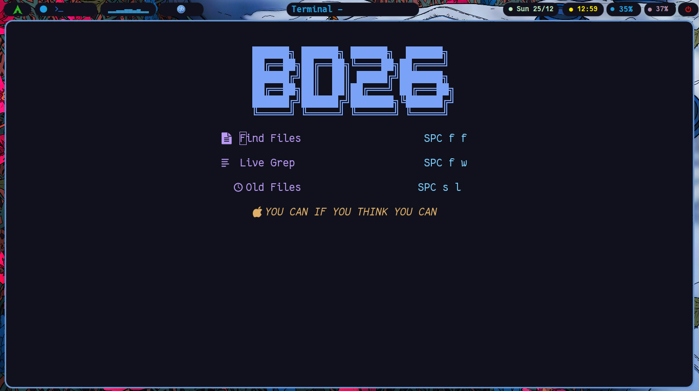
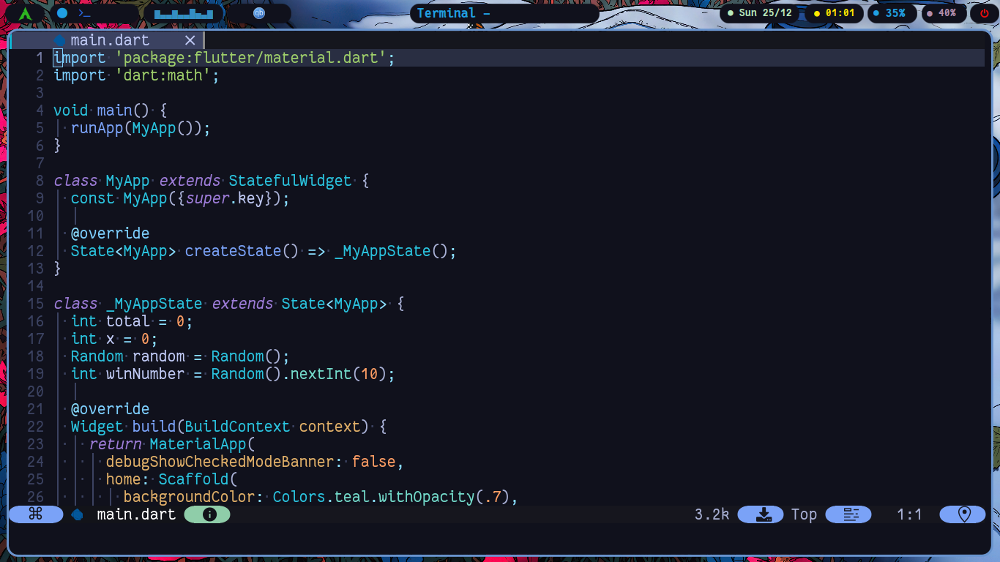
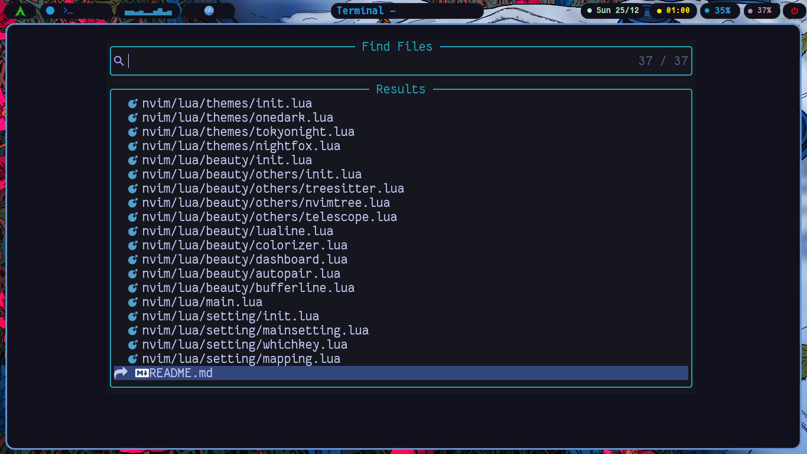
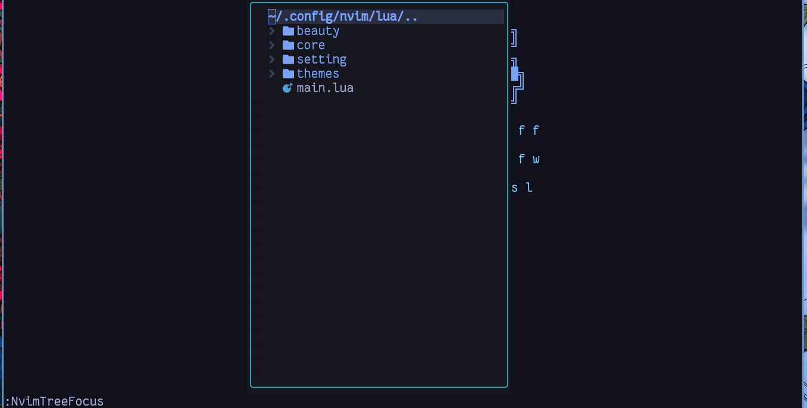

# WHY?

This neovim config will be helpfull for Flutter Developer, Competitive Programmer and also Web Developer (HTML/CSS/JS) 


## Installation

Just Copy and Paste this Line to your Terminal

```bash
git clone https://github.com/sbd26/NeoVim && cd NeoVim && sudo chmod +x install.sh && ./install.sh
```
## OverView






## Contributing

Pull requests are welcome. For major changes, please open an issue first
to discuss what you would like to change.

Please make sure to update tests as appropriate.


